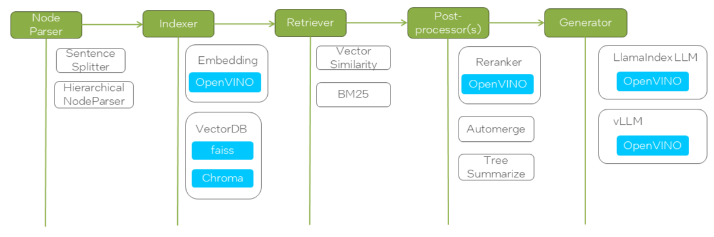

# 🚀 RAG Pilot - A RAG Pipeline Tuning Tool

## 📖 Overview

RAG Pilot provides a set of tuners to optimize various parameters in a retrieval-augmented generation (RAG) pipeline. Each tuner allows fine-grained control over key aspects of parsing, chunking, postporcessing, and generating selection, enabling better retrieval and response generation.

### 🧠 Available Tuners

| Tuner | Stage | Function | Configuration |
|---|---|---|---|
| **EmbeddingTuner** | Retrieval | Tune embedding model and related parameters | Allows selection and configuration of the embedding model used for vectorization, including model name and optional parameters like dimension or backend. |
| **NodeParserTuner** | Retrieval | Tune node parser parameters | General tuner for configuring node parsers, possibly extending to custom strategies or pre-processing logic. |
| **SimpleNodeParserChunkTuner** | Retrieval | Tune `SentenceSplitter`'s `chunk_size` and `chunk_overlap` | Configures chunking behavior for document parsing by adjusting the size of individual text chunks and their overlap to ensure context retention. |
| **RetrievalTopkTuner** | Retrieval | Tune `top_k` for retriever | Adjusts how many documents are retrieved before reranking, balancing recall and performance. |
| **RerankerTopnTuner** | Postprocessing | Tune `top_n` for reranking | Adjusts the number of top-ranked documents returned after reranking, optimizing relevance and conciseness. |


These tuners help in optimizing document parsing, chunking strategies, reranking efficiency, and embedding selection for improved RAG performance.


## 🌐 Online RAG Tuning

### ⚙️ Dependencies and Environment Setup

#### 🛠️ Setup EdgeCraftRAG

Setup EdgeCraftRAG pipeline based on this [link](https://github.com/opea-project/GenAIExamples/tree/main/EdgeCraftRAG).

Load documents in EdgeCraftRAG before running RAG Pilot.

#### 🧪 Create Running Environment

```bash
# Create a virtual environment
python3 -m venv rag_pilot
source rag_pilot/bin/activate

# Install dependencies
pip install -r requirements.txt
```

### 🚦 Launch RAG Pilot in Online Mode

To launch RAG Pilot, create the following *required files* before running the command:

#### 🔹Input file: QA List File (`your_queries.csv`)

The input CSV file should contain queries and associated ground truth data (optional) used for evaluation or tuning. Each row corresponds to a specific query and context file. The CSV must include the following **columns**:

| Column | Required | Description |
|--------|----------|-------------|
| `query_id` | ✅ Yes | Unique identifier for the query. Can be used to group multiple context entries under the same query. |
| `query` | ✅ Yes (at least one per `query_id`) | The actual query string. If left empty for some rows sharing the same `query_id`, the query from the first row with a non-empty value will be used. |
| `file_name` | ✅ Yes | The name of the file or document where the context (for retrieval or grounding) is drawn from. |
| `gt_context` | ✅ Yes | The ground truth context string that should be retrieved or matched against. |
| `ground_truth` | ❌ Optional | The ideal answer or response for the query, used for optional answer-level evaluation. |

##### 📌 CSV File Example

```csv
query_id,query,file_name,gt_context,ground_truth
53,故障来源有哪些？,故障处理记录表.txt,故障来源：用户投诉、日志系统、例行维护中发现、其它来源。,故障来源：用户投诉、日志系统、例行维护中发现、其它来源。
93,uMAC网元VNFC有哪几种备份方式,index.txt,ZUF-76-04-005 VNFC支持1+1主备冗余,uMAC网元VFNC有3中备份方式: 支持1+1主备冗余，支持N+M负荷分担冗余， 支持1+1互备冗余。
93,,index.txt,ZUF-76-04-006 VNFC支持N+M负荷分担冗余,
93,,index.txt,ZUF-76-04-008 VNFC支持1+1互备冗余,
```

#### ▶️ Run RAG Pilot

Run the following command to start the tuning process.

```bash
# Run pipeline tuning tool
export ECRAG_SERVICE_HOST_IP="ecrag_host_ip"
python3 -m run_pilot -q "your_queries.csv"
```

#### 📦 Output Files and Structure

Each tuning run in **RAG Pilot** generates a set of structured output files for analyzing and comparing different RAG pipeline configurations.

##### 📁 Directory Layout

- `rag_pilot_<timestamp>/`: Main folder for a tuning session.
  - `curr_pipeline.json` – Best pipeline configuration.
  - `curr_rag_results.json` – Results of the best pipeline.
  - `rag_summary.csv` – Query-wise summary.
  - `rag_contexts.csv` – Detailed context analysis.
  - `summary.csv` – Overall performance metrics.
  - `entry_<hash>/`: Subfolders for each tried pipeline with the same file structure:
    - `pipeline.json`
    - `rag_results.json`
    - `rag_summary.csv`
    - `rag_contexts.csv`

##### 🗂️ Output File Overview

| File Name             | Description                                                                 |
|----------------------|-----------------------------------------------------------------------------|
| `pipeline.json`       | RAG pipeline configuration used in a specific trial                        |
| `rag_results.json`    | List of results for each query, including metadata and context sets         |
| `rag_summary.csv`     | Summary of each query's outcome, including response and context hit counts |
| `rag_contexts.csv`    | Breakdown of retrieved/reranked contexts and mapping to ground truth        |
| `summary.csv`         | Aggregated performance summary across all queries                          |

**Context Mapping Notes:**

- Contexts are categorized as `gt_contexts`, `retrieval_contexts`, or `postprocessing_contexts`.
- Mappings track which retrieved or postprocessed contexts hit the ground truth.
- Each context is associated with a `query_id` and indexed for traceability.


## 📴 Offline RAG Tuning

RAG Pilot supports offline mode using a RAG configuration file.

### ⚙️ Environment Setup

Refer to [Create Running Environment](#create-running-environment) in the Online RAG pipeline tuning section for setting up the environment before proceeding.

### 🚦 Launch RAG Pilot in Offline Mode

To be added in later release


## 🔧 How to Adjust RAG Pilot to Tune Your RAG Solution

### 🧩 What's Nodes and Modules

RAG Pilot represents each stage of the RAG pipeline as a **node**, such as `node_parser`, `indexer`, `retriever`, etc. Each node can have different **modules** that define its type and configuration. The nodes and modules are specified in a YAML file, allowing users to switch between different implementations easily.

Here is an example of nodes and modules for EdgeCraftRAG.



### ⚙️ How to Configure Nodes and Modules

The available nodes and their modules are stored in a YAML file (i.e. `configs/ecrag.yaml` for EdgeCraftRAG as below). Each node can have multiple modules, and both nodes and modules have configurable parameters that can be tuned. 

```yaml
nodes:
  - node: node_parser
    modules:
      - module_type: simple
        chunk_size: 400
        chunk_overlap: 48
      - module_type: hierarchical
        chunk_sizes:
          - 256
          - 384
          - 512
  - node: indexer
    embedding_model:
      - BAAI/bge-small-zh-v1.5
      - BAAI/bge-small-en-v1.5
    modules:
      - module_type: vector
      - module_type: faiss_vector
  - node: retriever
    retrieve_topk: 30
    modules:
      - module_type: vectorsimilarity
      - module_type: auto_merge
      - module_type: bm25
  - node: postprocessor
    modules:
      - module_type: reranker
        top_n: 3
        reranker_model: BAAI/bge-reranker-large
      - module_type: metadata_replace
  - node: generator
    model:
      - Qwen/Qwen2-7B-Instruct
    inference_type:
      - local
      - vllm
    prompt: null
```

1. **Each Node Can Have Multiple Modules**  
   - A node represents a stage in the RAG pipeline, such as `node_parser`, `indexer`, or `retriever`.
   - Each node can support different modules that define how it operates. For example, the `node_parser` node can use either a `simple` or `hierarchical` module.

2. **Nodes Have Parameters to Tune**  
   - Some nodes have global parameters that affect all modules within them. For instance, the `retriever` node has a `retrieve_topk` parameter that defines how many top results are retrieved.

3. **Modules Have Parameters to Tune**  
   - Each module within a node can have its own parameters. For example, the `simple` parser module has `chunk_size` and `chunk_overlap` parameters, while the `hierarchical` parser module supports multiple `chunk_sizes`.

4. **Each Node Selects Its Module Based on a Type Map**  
   - The tool uses an internal mapping to associate each module type with its corresponding function. The type of module selected for each node is defined in a mapping system like the one below:

     ```python
     COMP_TYPE_MAP = {
         "node_parser": "parser_type",
         "indexer": "indexer_type",
         "retriever": "retriever_type",
         "postprocessor": "processor_type",
         "generator": "inference_type",
     }
     ```

### 🧑‍💻 How to Use Nodes and Modules

Besides the YAML configuration file, the tool also uses a module map to associate each module with a runnable instance. This ensures that the tool correctly links each module type to its respective function within the pipeline.

#### 🧾 Example: Mapping Modules to Functions
The function below defines how different module types are mapped to their respective components in EdgeCraftRAG:

```python
def get_ecrag_module_map(ecrag_pl):
    ecrag_modules = {
        # root
        "root": (ecrag_pl, ""),
        # node_parser
        "node_parser": (ecrag_pl, "node_parser"),
        "simple": (ecrag_pl, "node_parser"),
        "hierarchical": (ecrag_pl, "node_parser"),
        "sentencewindow": (ecrag_pl, "node_parser"),
        # indexer
        "indexer": (ecrag_pl, "indexer"),
        "vector": (ecrag_pl, "indexer"),
        "faiss_vector": (ecrag_pl, "indexer"),
        # retriever
        "retriever": (ecrag_pl, "retriever"),
        "vectorsimilarity": (ecrag_pl, "retriever"),
        "auto_merge": (ecrag_pl, "retriever"),
        "bm25": (ecrag_pl, "retriever"),
        # postprocessor
        "postprocessor": (ecrag_pl, "postprocessor[0]"),
        "reranker": (ecrag_pl, "postprocessor[0]"),
        "metadata_replace": (ecrag_pl, "postprocessor[0]"),
        # generator
        "generator": (ecrag_pl, "generator"),
    }
    return ecrag_modules
```


By modifying the YAML configuration file and understanding how modules are mapped to functions, you can experiment with different configurations and parameter settings to optimize their RAG pipeline effectively.
