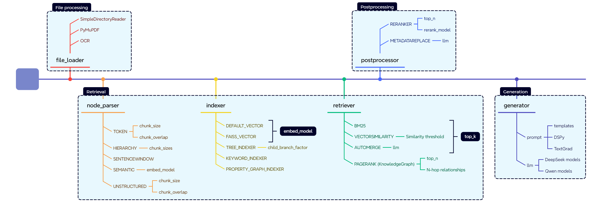

# RAG Pilot - A RAG Pipeline Tuning Tool

## Overview

RAG Pilot provides a set of tuners to optimize various parameters in a retrieval-augmented generation (RAG) pipeline. Each tuner allows fine-grained control over key aspects of parsing, chunking, postporcessing, and generating selection, enabling better retrieval and response generation.

### Available Tuners

| Tuner | Function | Configuration |
|---|---|---|
| **NodeParserTypeTuner** | Switch between `simple` and `hierarchical` node parsers | The `simple` parser splits text into basic chunks using [`SentenceSplitter`](https://docs.llamaindex.ai/en/stable/api_reference/node_parsers/sentence_splitter/), while the `hierarchical` parser ([`HierarchicalNodeParser`](https://docs.llamaindex.ai/en/v0.10.17/api/llama_index.core.node_parser.HierarchicalNodeParser.html)) creates a structured hierarchy of nodes to maintain contextual relationships. |
| **SimpleNodeParserChunkTuner** | Tune `SentenceSplitter`'s `chunk_size` and `chunk_overlap` | Configures chunking behavior for document parsing by adjusting the size of individual text chunks and their overlap to ensure context retention. |
| **RerankerTopnTuner** | Tune `top_n` for reranking | Adjusts the number of top-ranked documents retrieved, optimizing the relevance of retrieved results. |
| **EmbeddingLanguageTuner** | Select the embedding model | Configures the embedding model for retrieval, allowing users to select different models for vector representation. |

These tuners help in optimizing document parsing, chunking strategies, reranking efficiency, and embedding selection for improved RAG performance.


## Online RAG Tuning

### Dependencies and Environment Setup

#### Setup EdgeCraftRAG

Setup EdgeCraftRAG pipeline based on this [link](https://github.com/opea-project/GenAIExamples/tree/main/EdgeCraftRAG).

Load documents in EdgeCraftRAG before running RAG Pilot.

#### Create Running Environment

```bash
# Create a virtual environment
python3 -m venv tuning
source tuning/bin/activate

# Install dependencies
pip install -r requirements.txt
```

### Launch RAG Pilot in Online Mode

To launch RAG Pilot, create the following *required files* before running the command:

#### QA List File (`your_qa_list.json`)
Contains queries and optional ground truth answers. Below is a sample format:

```json
[
    {
        "query": "鸟类的祖先是恐龙吗？哪篇课文里讲了相关的内容？", 
        "ground_truth": "是的，鸟类的祖先是恐龙，这一内容在《飞向蓝天的恐龙》一文中有所讨论"
    },
    {
        "query": "桃花水是什么季节的水？"
    }
]
```

Run the following command to start the tuning process. The output RAG results will be stored in `rag_pipeline_out.json`:

```bash
# Run pipeline tuning tool
export ECRAG_SERVICE_HOST_IP="ecrag_host_ip"
python3 -m pipeline_tune -q "your_qa_list.json" -o "rag_pipeline_out.json"
```

## Offline RAG Tuning

RAG Pilot supports offline mode using a RAG configuration file.

### Environment Setup

Refer to [Create Running Environment](#create-running-environment) in the Online RAG pipeline tuning section for setting up the environment before proceeding.

### Launch RAG Pilot in Offline Mode

To launch RAG Pilot, create the following *required files* before running the command:

#### RAG Configuration File (`your_rag_pipeline.json`)
Settings for the RAG pipeline. Please follow the format of file `configs/pipeline_sample.json`, which is compatible with [EdgeCraftRAG](https://github.com/opea-project/GenAIExamples/tree/main/EdgeCraftRAG)

#### RAG Results File (`your_rag_results.json`)
Contains queries, responses, lists of contexts, and optional ground truth. Below is a sample format:

```json
[
    {
        "query": "鸟类的祖先是恐龙吗？哪篇课文里讲了相关的内容？",
        "contexts": ["恐龙演化成鸟类的证据..."],
        "response": "是的，鸟类的祖先是恐龙。",
        "ground_truth": "是的，鸟类的祖先是恐龙，这一内容在《飞向蓝天的恐龙》一文中有所讨论"
    }
]
```

Run the following command to start offline tuning. The output RAG results will be stored in `rag_pipeline_out.json`:

```bash
python3 -m pipeline_tune --offline -c "your_rag_pipeline.json" -r "your_rag_results.json" -o "rag_pipeline_out.json"
```

## How to use RAG Pilot to tune your RAG solution

### What's Nodes and Modules

RAG Pilot represents each stage of the RAG pipeline as a **node**, such as `node_parser`, `indexer`, `retriever`, etc. Each node can have different **modules** that define its type and configuration. The nodes and modules are specified in a YAML file, allowing users to switch between different implementations easily.

Here is an example of nodes and modules for EdgeCraftRAG.



### How to configure Nodes and Modules

The available nodes and their modules are stored in a YAML file (i.e. `configs/ecrag.yaml` for EdgeCraftRAG as below). Each node can have multiple modules, and both nodes and modules have configurable parameters that can be tuned. 

```yaml
nodes:
  - node: node_parser
    modules:
      - module_type: simple
        chunk_size: 400
        chunk_overlap: 48
      - module_type: hierarchical
        chunk_sizes: [256, 384, 512]
  - node: indexer
    embedding_model: [BAAI/bge-small-zh-v1.5, BAAI/bge-small-en-v1.5]
    modules:
      - module_type: vector
      - module_type: faiss_vector
  - node: retriever
    retrieve_topk: 30
    modules:
      - module_type: vectorsimilarity
      - module_type: auto_merge
      - module_type: bm25
  - node: postprocessor
    modules:
      - module_type: reranker
        top_n: 3
        reranker_model: BAAI/bge-reranker-large
      - module_type: metadata_replace
  - node: generator
    model: [Qwen/Qwen2-7B-Instruct]
    inference_type: [local, vllm]
    prompt: null
```

1. **Each Node Can Have Multiple Modules**  
   - A node represents a stage in the RAG pipeline, such as `node_parser`, `indexer`, or `retriever`.
   - Each node can support different modules that define how it operates. For example, the `node_parser` node can use either a `simple` or `hierarchical` module.

2. **Nodes Have Parameters to Tune**  
   - Some nodes have global parameters that affect all modules within them. For instance, the `retriever` node has a `retrieve_topk` parameter that defines how many top results are retrieved.

3. **Modules Have Parameters to Tune**  
   - Each module within a node can have its own parameters. For example, the `simple` parser module has `chunk_size` and `chunk_overlap` parameters, while the `hierarchical` parser module supports multiple `chunk_sizes`.

4. **Each Node Selects Its Module Based on a Type Map**  
   - The tool uses an internal mapping to associate each module type with its corresponding function. The type of module selected for each node is defined in a mapping system like the one below:

     ```python
     COMP_TYPE_MAP = {
         "node_parser": "parser_type",
         "indexer": "indexer_type",
         "retriever": "retriever_type",
         "postprocessor": "processor_type",
         "generator": "inference_type",
     }
     ```

### How to use Nodes and Modules

Besides the YAML configuration file, the tool also uses a module map to associate each module with a runnable instance. This ensures that the tool correctly links each module type to its respective function within the pipeline.

#### Example: Mapping Modules to Functions
The function below defines how different module types are mapped to their respective components in EdgeCraftRAG:

```python
def get_ecrag_module_map(ecrag_pl):
    ecrag_modules = {
        # root
        "root": (ecrag_pl, ""),
        # node_parser
        "node_parser": (ecrag_pl, "node_parser"),
        "simple": (ecrag_pl, "node_parser"),
        "hierarchical": (ecrag_pl, "node_parser"),
        "sentencewindow": (ecrag_pl, "node_parser"),
        # indexer
        "indexer": (ecrag_pl, "indexer"),
        "vector": (ecrag_pl, "indexer"),
        "faiss_vector": (ecrag_pl, "indexer"),
        # retriever
        "retriever": (ecrag_pl, "retriever"),
        "vectorsimilarity": (ecrag_pl, "retriever"),
        "auto_merge": (ecrag_pl, "retriever"),
        "bm25": (ecrag_pl, "retriever"),
        # postprocessor
        "postprocessor": (ecrag_pl, "postprocessor[0]"),
        "reranker": (ecrag_pl, "postprocessor[0]"),
        "metadata_replace": (ecrag_pl, "postprocessor[0]"),
        # generator
        "generator": (ecrag_pl, "generator"),
    }
    return ecrag_modules
```


By modifying the YAML configuration file and understanding how modules are mapped to functions, you can experiment with different configurations and parameter settings to optimize their RAG pipeline effectively.
