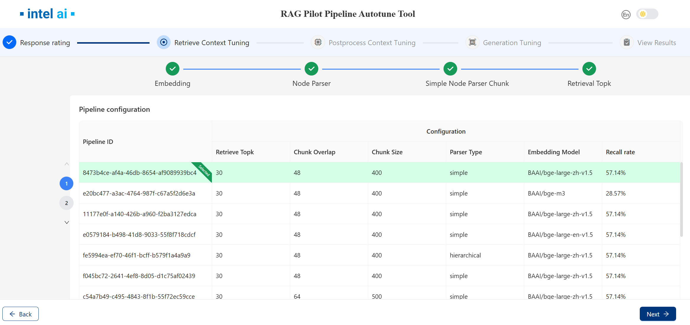
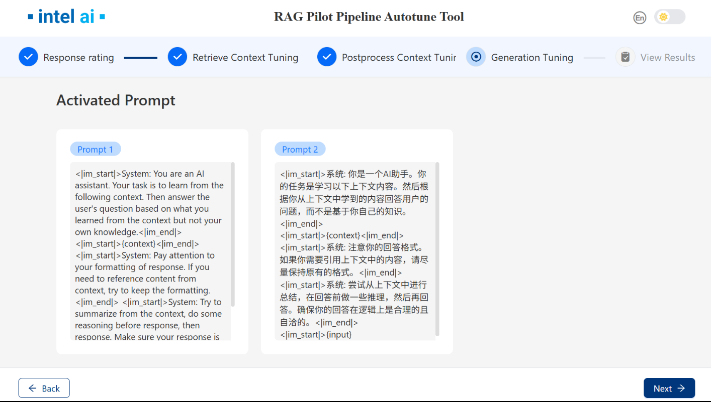
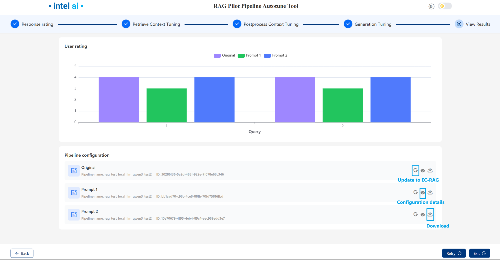

# 🚀 RAG Pilot - A RAG Pipeline Tuning Tool

## 📖 Overview

RAG Pilot provides a set of tuners to optimize various parameters in a retrieval-augmented generation (RAG) pipeline. Each tuner allows fine-grained control over key aspects of parsing, chunking, postporcessing, and generating selection, enabling better retrieval and response generation.

## 🧠 Available Tuners

| Tuner | Stage | Function | Configuration |
|---|---|---|---|
| **EmbeddingModelTuner** | Retrieval | Tune embedding model and related parameters | Allows selection and configuration of the embedding model used for vectorization, including model name and optional parameters like dimension or backend. |
| **NodeParserTuner** | Retrieval | Tune `SentenceSplitter`'s `chunk_size` and `chunk_overlap` | Configures chunking behavior for document parsing by adjusting the size of individual text chunks and their overlap to ensure context retention. |
| **RetrievalTopkTuner** | Retrieval | Tune `top_k` for retriever | Adjusts how many documents are retrieved before reranking, balancing recall and performance. |
| **RerankerTopnTuner** | Postprocessing | Tune `top_n` for reranking | Adjusts the number of top-ranked documents returned after reranking, optimizing relevance and conciseness. |
| **PromptTuner** | Generator | Tune `prompt` for generator |Generate multiple responses using different prompts for users. |

These tuners help in optimizing document parsing, chunking strategies, reranking efficiency, and embedding selection for improved RAG performance.


## 🚦 How to use RAG Pilot

### ▶️ Use RAG Pilot with UI

RAG Pilot provides an interactive UI interface to assist with usage, including the following stages：
#### 1. Set EC-RAG endpoint
Click the gear button to set EC-RAG endpoint:

#### 2. Ground truth upload
We provide two ways to upload Ground truth:
`Upload File` and `Create New`
First time you use Rag Pilot you can start with `Create Now`.
##### 2.1 Create Now

  
- Available options and  meanings:
  | Item | usage |
  |---|---|
  | **Query** | The query you want to ask. |
  | **File name** | File name which containing the context, select from the drop-down menu. |
  | **Context** | Context ground truth which related to the query. |
  | **Section** | Node with context in the file. |
  | **Pages** | The page number of the context in the file.  |

- `Add Context`: Add context of the same query.
- `Add Query` : Add other queries infornation.
- `Save`: Save single query ground truth information.
- `Batch Save`: Save all queries ground truth information.
- Once the user click `Save` or `Batch Save` button ,RAG Pilot will search matched nodes based on the ground truth information you entered as ground truth. If no matched node, RAG Pilot will will return the top few nodes with the highest match scores for the user to select:
  
- After create gt, you can click `download` button to download ground truth file for `Upload Files`.

##### 2.2 Upload files
After create gt, you can use downloaded json file as upload file.

#### 3. Response Rating
After groud truth loading, RAG Pilot wii generate response bases on EC-RAG current pipeline.
- Click `Run` to get rating results.
- Click  `Skip` to skip rating.

  

After clicking `Run`:
- You can rating each result after the responses generated.
- Click numbers on the left to switch between responses of different queries.
- Click `Next` to the next stage.

  
#### 4. Retrieve Context Tuning
During this stage, RAG Pilot will execute four tuners:`ObserberTuner`, `EmbeddingModelTuner`, `NodeParserTuner` and `RetrievalTopKTuner`.

##### 4.1 Retrieve Context Tuning Configure
You can configure the specific content for each tuners.
- Click `Run Tuners` will start retrieval stage tuning.
- Click `Cancel` then click `Skip` to skip the Retrieve Context Tuning stage.
- Support exporting and importing tuners configure with `Export` and `Import` buttons.

  
##### 4.2 Retrieve Context Tuning Run & Results
After clicking `Run Tuners`, these tuners will experiment with various parameter combinations to construct corresponding pipelines, ultimately selecting the most effective pipeline as the operational one.

- Click numbers on the left to switch between different queries.

  

- Once the selected tuners have completed their tasks, the page will display the results, including the `ground truth hits` and the `retrieved chunks`.

- Users can search text via the search box in the upper-right corner to observe which parts of the context match the ground truth context. Text entered into the search box will be highlighted.

  

- Click `Next` to the Postprocess Context Tuning stage.


#### 5. Postprocess Context Tuning
This stage includes one tuner:`RerankerTopnTuner` which adjusts the number of top-ranked documents returned after reranking, optimizing relevance and conciseness.
##### 5.1 Postprocess Context Tuning Configure
Users can configure `RerankerTopnTuner` with UI.
- Click `Run Tuners` will start retrieval stage tuning.
- Click `Cancel` then click `Skip` to skip the Postprocess Context Tuning.
- Support exporting and importing tuners configure with `Export` and `Import` buttons.

  

##### 5.2 Postprocess Context Tuning Run & Results

After the tuning finished, the page will show recall plots of different `topn`.


- You can select the desired `Top n` value.

- The page will display the `ground truth hits` from both the postprocessing and retrieval stages, as well as the `retrieved chunks` from the postprocessing stage.

- Click numbers on the left to switch between different queries.

- Users can search text via the search box in the upper-right corner to observe which parts of the context match the ground truth context. Text entered into the search box will be highlighted.


  

- Click `Next` to the generation tuning stage.

#### 6. Generation tuning
This stage includes one tuner: `PromptTuner`, you can add your own prompts to generate different responses. 
##### 6.1 Generation Tuning Configure
Users can configure `PromptTuner` with UI:
- Click `Cancel` then click `Skip` to skip the Generation Tuning.
- Support exporting and importing tuners configure with `Export` and `Import` buttons.

  

- Click `Run tuners` will display all activated prompts:

  

- Click `Next` to utilize these prompts to generate answers.

##### 6.2 Generation Tuning Run & Results


Once the response is generated, you can then evaluate and rate the responses generated from different prompts.

Click numbers on the left to switch between different queries.


Click `Next` to the next stage.

#### 7. View Results
After `Generation tuning` stage, you can see the overall rating of different prompts. For each pipeline, you can view configuration details and update them to EC-RAG.




Note that once you run `retrieval`,`postprocessing` or `generation` stage , the EC-RAG active pipeline will be changed, you have to reset EC-RAG pipeline in EC-RAG server if needed.

### ▶️ Use RAG Pilot with RESTful API
#### Set EC-RAG endpoint
```bash
 curl -X POST http://localhost:16030/v1/pilot/settings   
      -H 'Content-Type: application/json'
      -d '{"target_endpoint": "10.67.106.189:16010","target_type":"ecrag"}'| jq '.'
```
#### Upload ground truth
```bash
curl -X POST http://localhost:16030/v1/pilot/ground_truth/file \
     -H "Content-Type: multipart/form-data" \
     -F "file=@{your ground truth csv path}"  | jq '.'
```
#### Get current active pipeline
```bash
# get active pipeline id
curl -X GET http://localhost:16030/v1/pilot/pipeline/active/id | jq '.'
#get active pipeline detail configs
curl -X GET http://localhost:16030/v1/pilot/pipeline/active | jq '.'
```
#### Run current pipeline
```bash
curl -X POST http://localhost:16030/v1/pilot/pipeline/active/run| jq '.'
```
#### Get pipeline results
```bash
#get detail results
curl -X GET http://localhost:16030/v1/pilot/pipeline/{pipeline id}/results | jq '.'
#get pipeline metrics
curl -X GET http://localhost:16030/v1/pilot/pipeline/{pipeline id}/results/metrics | jq '.'
```
#### Run different stages
```bash
#stage including retrieval,postprocessing and generation
curl -X POST http://localhost:16030/v1/tuners/stage/{stage}/run | jq '.'
```
#### Get stage states
```bash
curl -X GET http://localhost:16030/v1/tuners/stage/{stage}/status | jq '.'
```
#### Get stage results
```bash
#get stage detail results
curl -X GET http://localhost:16030/v1/tuners/stage/{stage}/results | jq '.'
#get stage metrics
curl -X GET http://localhost:16030/v1/tuners/stage/{stage}/results/metrics | jq '.'
```
#### Get best stage pipeline
```bash
curl -X GET http://localhost:16030/v1/tuners/stage/{stage}/pipelines/best/id | jq '.'
```

#### Reset
##### Reset stage
```bash
curl -X POST http://localhost:16030/v1/tuners/stage/{stage}/reset | jq '.'
```
Note that once you run `retrieval`,`postprocessing` or `generation` stage , the EC-RAG active pipeline will be changed, you have to reset EC-RAG pipeline in EC-RAG server if needed.
## 🔧 How to Adjust RAG Pilot to Tune Your RAG Solution

### 🧩 What's Nodes and Modules

RAG Pilot represents each stage of the RAG pipeline as a **node**, such as `node_parser`, `indexer`, `retriever`, etc. Each node can have different **modules** that define its type and configuration. The nodes and modules are specified in a YAML file, allowing user to switch between different implementations easily.

Here is an example of nodes and modules for EdgeCraftRAG.


### ⚙️ How to Configure Nodes and Modules

The available nodes and their modules are stored in a YAML file (i.e. `configs/ecrag.yaml` for EdgeCraftRAG as below). Each node can have multiple modules, and both nodes and modules have configurable parameters that can be tuned. 

```yaml
nodes:
  - node: node_parser
    modules:
      - module_type: simple
        chunk_size: 400
        chunk_overlap: 48
      - module_type: hierarchical
        chunk_sizes:
          - 256
          - 384
          - 512
  - node: indexer
    embedding_model:
      - BAAI/bge-small-zh-v1.5
      - BAAI/bge-small-en-v1.5
    modules:
      - module_type: vector
      - module_type: faiss_vector
  - node: retriever
    retrieve_topk: 30
    modules:
      - module_type: vectorsimilarity
      - module_type: auto_merge
      - module_type: bm25
  - node: postprocessor
    modules:
      - module_type: reranker
        top_n: 3
        reranker_model: BAAI/bge-reranker-large
      - module_type: metadata_replace
  - node: generator
    model:
      - Qwen/Qwen2-7B-Instruct
    inference_type:
      - local
      - vllm
    prompt: null
```

1. **Each Node Can Have Multiple Modules**  
   - A node represents a stage in the RAG pipeline, such as `node_parser`, `indexer`, or `retriever`.
   - Each node can support different modules that define how it operates. For example, the `node_parser` node can use either a `simple` or `hierarchical` module.

2. **Nodes Have Parameters to Tune**  
   - Some nodes have global parameters that affect all modules within them. For instance, the `retriever` node has a `retrieve_topk` parameter that defines how many top results are retrieved.

3. **Modules Have Parameters to Tune**  
   - Each module within a node can have its own parameters. For example, the `simple` parser module has `chunk_size` and `chunk_overlap` parameters, while the `hierarchical` parser module supports multiple `chunk_sizes`.

4. **Each Node Selects Its Module Based on a Type Map**  
   - The tool uses an internal mapping to associate each module type with its corresponding function. The type of module selected for each node is defined in a mapping system like the one below:

     ```python
     COMP_TYPE_MAP = {
         "node_parser": "parser_type",
         "indexer": "indexer_type",
         "retriever": "retriever_type",
         "postprocessor": "processor_type",
         "generator": "inference_type",
     }
     ```

### 🧑‍💻 How to Use Nodes and Modules

Besides the YAML configuration file, the tool also uses a module map to associate each module with a runnable instance. This ensures that the tool correctly links each module type to its respective function within the pipeline.

#### 🧾 Example: Mapping Modules to Functions
The function below defines how different module types are mapped to their respective components in EdgeCraftRAG:

```python
def get_ecrag_module_map(ecrag_pl):
    ecrag_modules = {
        # root
        "root": (ecrag_pl, ""),
        # node_parser
        "node_parser": (ecrag_pl, "node_parser"),
        "simple": (ecrag_pl, "node_parser"),
        "hierarchical": (ecrag_pl, "node_parser"),
        "sentencewindow": (ecrag_pl, "node_parser"),
        # indexer
        "indexer": (ecrag_pl, "indexer"),
        "vector": (ecrag_pl, "indexer"),
        "faiss_vector": (ecrag_pl, "indexer"),
        # retriever
        "retriever": (ecrag_pl, "retriever"),
        "vectorsimilarity": (ecrag_pl, "retriever"),
        "auto_merge": (ecrag_pl, "retriever"),
        "bm25": (ecrag_pl, "retriever"),
        # postprocessor
        "postprocessor": (ecrag_pl, "postprocessor[0]"),
        "reranker": (ecrag_pl, "postprocessor[0]"),
        "metadata_replace": (ecrag_pl, "postprocessor[0]"),
        # generator
        "generator": (ecrag_pl, "generator"),
    }
    return ecrag_modules
```


By modifying the YAML configuration file and understanding how modules are mapped to functions, you can experiment with different configurations and parameter settings to optimize their RAG pipeline effectively.
