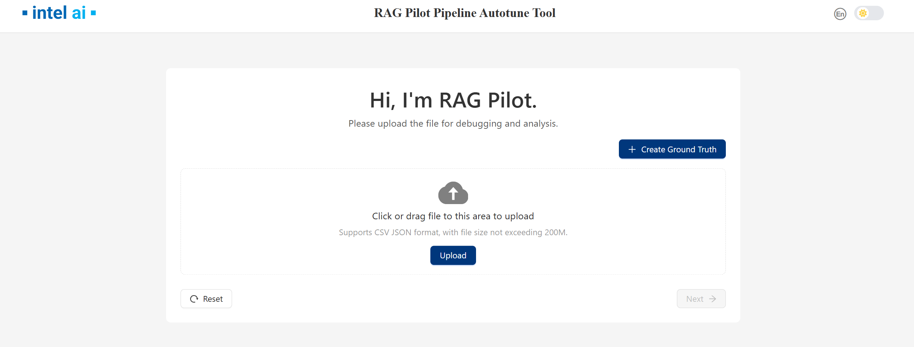

# 🚀 RAG Pilot - A RAG Pipeline Tuning Tool

## 📖 Overview

RAG Pilot provides a set of tuners to optimize various parameters in a retrieval-augmented generation (RAG) pipeline. Each tuner allows fine-grained control over key aspects of parsing, chunking, postporcessing, and generating selection, enabling better retrieval and response generation.

## 🧠 Available Tuners

| Tuner | Stage | Function | Configuration |
|---|---|---|---|
| **EmbeddingTuner** | Retrieval | Tune embedding model and related parameters | Allows selection and configuration of the embedding model used for vectorization, including model name and optional parameters like dimension or backend. |
| **NodeParserTuner** | Retrieval | Tune node parser parameters | General tuner for configuring node parsers, possibly extending to custom strategies or pre-processing logic. |
| **SimpleNodeParserChunkTuner** | Retrieval | Tune `SentenceSplitter`'s `chunk_size` and `chunk_overlap` | Configures chunking behavior for document parsing by adjusting the size of individual text chunks and their overlap to ensure context retention. |
| **RetrievalTopkTuner** | Retrieval | Tune `top_k` for retriever | Adjusts how many documents are retrieved before reranking, balancing recall and performance. |
| **RerankerTopnTuner** | Postprocessing | Tune `top_n` for reranking | Adjusts the number of top-ranked documents returned after reranking, optimizing relevance and conciseness. |
| **PromptTuner** | Generator | Tune `prompt` for generator |Generate multiple responses using different prompts for users. |

These tuners help in optimizing document parsing, chunking strategies, reranking efficiency, and embedding selection for improved RAG performance.


## 🚦 How to use RAG Pilot

To launch RAG Pilot, create the following *required files* before running the command:

### 🔹Input file: QA List File (`your_queries.csv`)

The input CSV file should contain queries and associated ground truth data (optional) used for evaluation or tuning. Each row corresponds to a specific query and context file. The CSV must include the following **columns**:

| Column | Required | Description |
|--------|----------|-------------|
| `query_id` | ✅ Yes | Unique identifier for the query. Can be used to group multiple context entries under the same query. |
| `query` | ✅ Yes (at least one per `query_id`) | The actual query string. If left empty for some rows sharing the same `query_id`, the query from the first row with a non-empty value will be used. |
| `file_name` | ✅ Yes | The name of the file or document where the context (for retrieval or grounding) is drawn from. |
| `gt_context` | ✅ Yes | The ground truth context string that should be retrieved or matched against. |
| `ground_truth` | ❌ Optional | The ideal answer or response for the query, used for optional answer-level evaluation. |

#### 📌 CSV File Example

```csv
query_id,query,file_name,gt_context,ground_truth
53,故障来源有哪些？,故障处理记录表.txt,故障来源：用户投诉、日志系统、例行维护中发现、其它来源。,故障来源：用户投诉、日志系统、例行维护中发现、其它来源。
93,uMAC网元VNFC有哪几种备份方式,index.txt,ZUF-76-04-005 VNFC支持1+1主备冗余,uMAC网元VFNC有3中备份方式: 支持1+1主备冗余，支持N+M负荷分担冗余， 支持1+1互备冗余。
93,,index.txt,ZUF-76-04-006 VNFC支持N+M负荷分担冗余,
93,,index.txt,ZUF-76-04-008 VNFC支持1+1互备冗余,
```

### ▶️ Use RAG Pilot with UI

RAG Pilot provides an interactive UI interface to assist with usage, including the following stages：
#### 1. Ground Truth Uploading
Upload the QA List File mentioned above by click the `Upload` button:


Or you can also create your own ground truth by click the `Create Ground Truth` button, use `+` and `-` button to add or delete ground truth.


#### 2. Response Rating
After groud truth loading, RAG Pilot wii generate response bases on EC-RAG current pipeline.
You can rating each result after the responses generated.


#### 3. Retrieve Context Tuning
During this stage, RAG Pilot will execute four tuners: EmbeddingTuner, NodeParserTuner, SimpleNodeParserChunkTuner, and RerankerTopnTuner.

These tuners will experiment with various parameter combinations to construct corresponding pipelines, ultimately selecting the most effective pipeline as the operational one.


Once all four tuners have completed their tasks, the page will display the results, including the `ground truth hits` and the `retrieved chunks`.


#### 4. Postprocess Context Tuning
This stage adjusts the number of top-ranked documents returned after reranking, optimizing relevance and conciseness.
After this tuner finished, the page will show recall plots of different `topn`


You can select the desired `Top n` value. The page will display the `ground truth hits` from both the postprocessing and retrieval stages, as well as the `retrieved chunks` from the postprocessing stage.


#### 5. Generation tuning

This page will displays the activated prompts sourced from text files located in the `./prompt_templates` folder, along with detailed prompt contents specified in the `prompt_contents` section of the ecrag.yaml file.


After clicking the Next button, RAG Pilot will utilize these prompts to generate answers. You can then evaluate and rate the responses generated from different prompts.


#### 6. View Results
After `Generation tuning` stage, you can see the overall user rating of different prompts. For each pipeline, you can view configuration details, download the specific pipeline configurations, and update them to EC-RAG.


Note that once you run `retrieval`,`postprocessing` or `generation` stage , the EC-RAG active pipeline will be changed, you have to reset EC-RAG pipeline in EC-RAG server if needed.

### ▶️ Use RAG Pilot with RESTful API
#### Upload ground truth
```bash
curl -X POST http://localhost:16030/v1/pilot/ground_truth/file \
     -H "Content-Type: multipart/form-data" \
     -F "file=@{your ground truth csv path}"  | jq '.'
```
#### Get current active pipeline
```bash
# get active pipeline id
curl -X GET http://localhost:16030/v1/pilot/pipeline/active/id | jq '.'
#get active pipeline detail configs
curl -X GET http://localhost:16030/v1/pilot/pipeline/active | jq '.'
```
#### Run current pipeline
```bash
curl -X POST http://localhost:16030/v1/pilot/pipeline/active/run| jq '.'
```
#### Get pipeline results
```bash
#get detail results
curl -X GET http://localhost:16030/v1/pilot/pipeline/{pipeline id}/results | jq '.'
#get pipeline metrics
curl -X GET http://localhost:16030/v1/pilot/pipeline/{pipeline id}/results/metrics | jq '.'
```
#### Run different stages
```bash
#stage including retrieval,postprocessing and generation
curl -X POST http://localhost:16030/v1/tuners/stage/{stage}/run | jq '.'
```
#### Get stage states
```bash
curl -X GET http://localhost:16030/v1/tuners/stage/{stage}/status | jq '.'
```
#### Get stage results
```bash
#get stage detail results
curl -X GET http://localhost:16030/v1/tuners/stage/{stage}/results | jq '.'
#get stage metrics
curl -X GET http://localhost:16030/v1/tuners/stage/{stage}/results/metrics | jq '.'
```
#### Get best stage pipeline
```bash
curl -X GET http://localhost:16030/v1/tuners/stage/{stage}/pipelines/best/id | jq '.'
```

#### Reset
##### Restore EC-RAG current active pipeline
Once you change EC-RAG pipeline ,you can restore RAG Pilot active pipeline to the new EC-RAG pipeline by:
```bash
curl -X POST http://localhost:16030/v1/pilot/pipeline/restore | jq '.'
```
##### Reset stage
```bash
curl -X POST http://localhost:16030/v1/tuners/stage/{stage}/reset | jq '.'
```
Note that once you run `retrieval`,`postprocessing` or `generation` stage , the EC-RAG active pipeline will be changed, you have to reset EC-RAG pipeline in EC-RAG server if needed.
## 🔧 How to Adjust RAG Pilot to Tune Your RAG Solution

### 🧩 What's Nodes and Modules

RAG Pilot represents each stage of the RAG pipeline as a **node**, such as `node_parser`, `indexer`, `retriever`, etc. Each node can have different **modules** that define its type and configuration. The nodes and modules are specified in a YAML file, allowing users to switch between different implementations easily.

Here is an example of nodes and modules for EdgeCraftRAG.


### ⚙️ How to Configure Nodes and Modules

The available nodes and their modules are stored in a YAML file (i.e. `configs/ecrag.yaml` for EdgeCraftRAG as below). Each node can have multiple modules, and both nodes and modules have configurable parameters that can be tuned. 

```yaml
nodes:
  - node: node_parser
    modules:
      - module_type: simple
        chunk_size: 400
        chunk_overlap: 48
      - module_type: hierarchical
        chunk_sizes:
          - 256
          - 384
          - 512
  - node: indexer
    embedding_model:
      - BAAI/bge-small-zh-v1.5
      - BAAI/bge-small-en-v1.5
    modules:
      - module_type: vector
      - module_type: faiss_vector
  - node: retriever
    retrieve_topk: 30
    modules:
      - module_type: vectorsimilarity
      - module_type: auto_merge
      - module_type: bm25
  - node: postprocessor
    modules:
      - module_type: reranker
        top_n: 3
        reranker_model: BAAI/bge-reranker-large
      - module_type: metadata_replace
  - node: generator
    model:
      - Qwen/Qwen2-7B-Instruct
    inference_type:
      - local
      - vllm
    prompt: null
```

1. **Each Node Can Have Multiple Modules**  
   - A node represents a stage in the RAG pipeline, such as `node_parser`, `indexer`, or `retriever`.
   - Each node can support different modules that define how it operates. For example, the `node_parser` node can use either a `simple` or `hierarchical` module.

2. **Nodes Have Parameters to Tune**  
   - Some nodes have global parameters that affect all modules within them. For instance, the `retriever` node has a `retrieve_topk` parameter that defines how many top results are retrieved.

3. **Modules Have Parameters to Tune**  
   - Each module within a node can have its own parameters. For example, the `simple` parser module has `chunk_size` and `chunk_overlap` parameters, while the `hierarchical` parser module supports multiple `chunk_sizes`.

4. **Each Node Selects Its Module Based on a Type Map**  
   - The tool uses an internal mapping to associate each module type with its corresponding function. The type of module selected for each node is defined in a mapping system like the one below:

     ```python
     COMP_TYPE_MAP = {
         "node_parser": "parser_type",
         "indexer": "indexer_type",
         "retriever": "retriever_type",
         "postprocessor": "processor_type",
         "generator": "inference_type",
     }
     ```

### 🧑‍💻 How to Use Nodes and Modules

Besides the YAML configuration file, the tool also uses a module map to associate each module with a runnable instance. This ensures that the tool correctly links each module type to its respective function within the pipeline.

#### 🧾 Example: Mapping Modules to Functions
The function below defines how different module types are mapped to their respective components in EdgeCraftRAG:

```python
def get_ecrag_module_map(ecrag_pl):
    ecrag_modules = {
        # root
        "root": (ecrag_pl, ""),
        # node_parser
        "node_parser": (ecrag_pl, "node_parser"),
        "simple": (ecrag_pl, "node_parser"),
        "hierarchical": (ecrag_pl, "node_parser"),
        "sentencewindow": (ecrag_pl, "node_parser"),
        # indexer
        "indexer": (ecrag_pl, "indexer"),
        "vector": (ecrag_pl, "indexer"),
        "faiss_vector": (ecrag_pl, "indexer"),
        # retriever
        "retriever": (ecrag_pl, "retriever"),
        "vectorsimilarity": (ecrag_pl, "retriever"),
        "auto_merge": (ecrag_pl, "retriever"),
        "bm25": (ecrag_pl, "retriever"),
        # postprocessor
        "postprocessor": (ecrag_pl, "postprocessor[0]"),
        "reranker": (ecrag_pl, "postprocessor[0]"),
        "metadata_replace": (ecrag_pl, "postprocessor[0]"),
        # generator
        "generator": (ecrag_pl, "generator"),
    }
    return ecrag_modules
```


By modifying the YAML configuration file and understanding how modules are mapped to functions, you can experiment with different configurations and parameter settings to optimize their RAG pipeline effectively.
